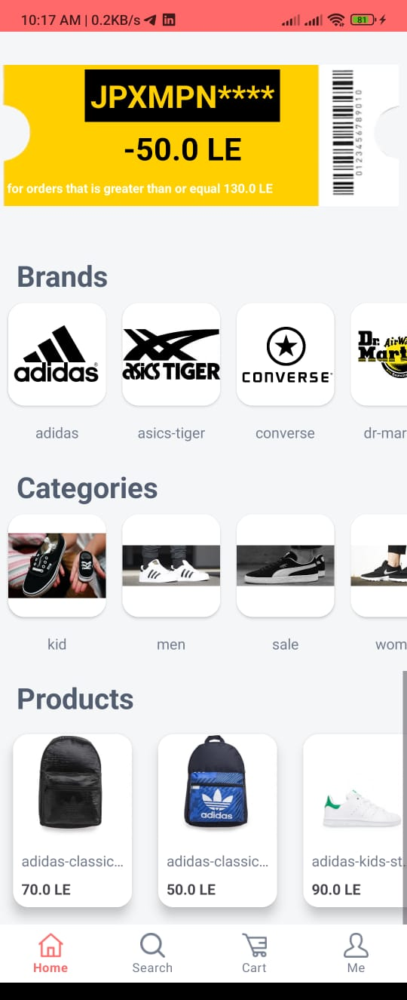
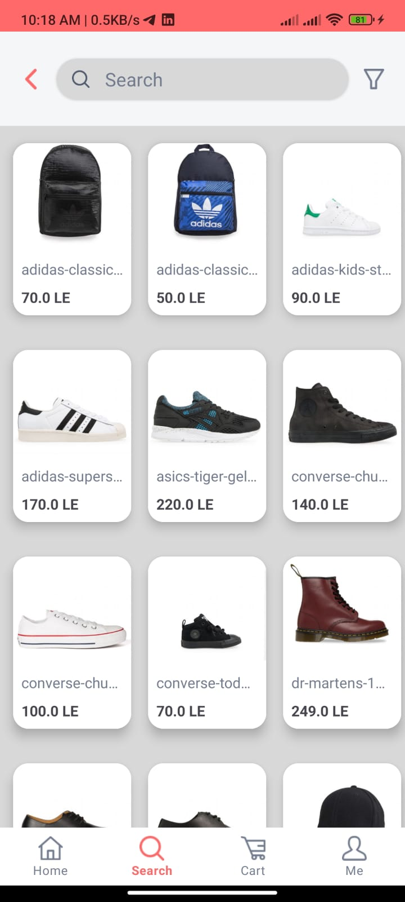
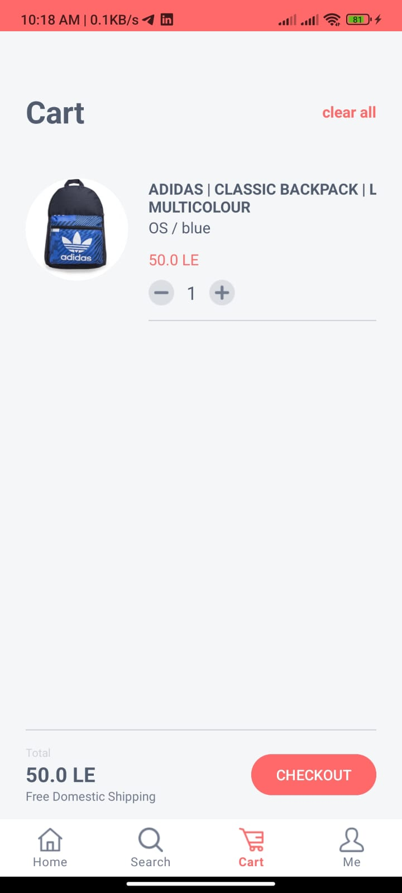
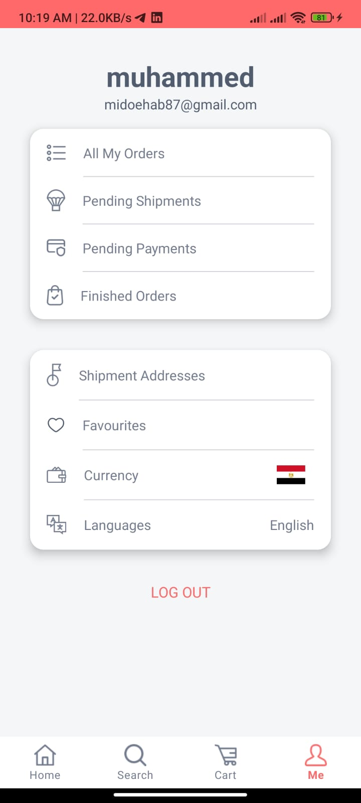

# Triple M
Triple M is an m-Commerce Application that presents products from different vendors and enables the authenticated users to add/remove products to/from their shopping carts and complete the whole shopping cycle online through the app.

## Application Features:
* Present to the user a grid arrangement of Shop products available in ShopifyDB upon launch.
* The user will have the option to filter the products based on the main category or sub-categories.
* Supply the user with search and some navigation options to:
  * search for a specific product
  * favorite products
  * shopping cart

## Tools used
* MVVM Architecture Pattern
* Kotlin
* XML
* Coroutines
* Kotlin Flow
* Room
* Retrofit
* Glide
* Recycler View
* Navigation Component
* Unit Testing
* Stripe
* Google Maps
* Firebase
* Shopify API

## Screenshots

  
  
  
  

